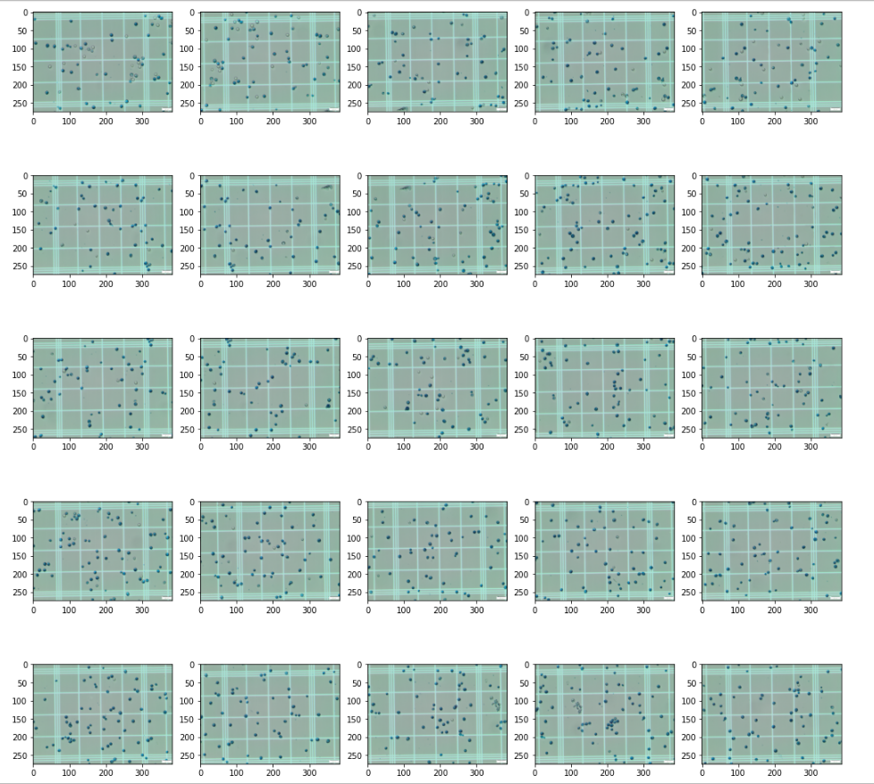
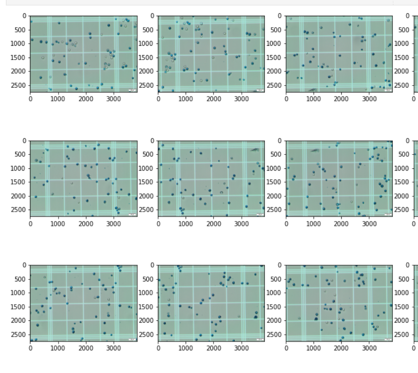

# Beer-Challenge-by-Visio

## Abstract
Measuring the quality of beer is an important task in industrial scale
fermentation processes. To do that, a lot of times, the proportion of
alive and dead yeast cells is used as the parameter that indicates this
quality measurement quantitatively. The procedure utilized for analyzing
this number involves diluting a fermentation sample with bromothymol blue
inside a Neubauer chamber and counting the numbers of alive and dead cells
through microscopic observation.

With that in mind, the objective of this challenge is to develop an image
processing method that calculates the amounts of both alive and dead cells
in a yeast sample. For that, one problem that needs to be tackled is that
since a single microscopic image can't cover the entirety of the observed
sample, images of its different parts must be used. Thus, to get a more
accurate estimate of the beer quality, the images of a partitioned sample
must be used to reconstruct an image that represents an entire sample.  The
other one is that the reconstructed image of a sample must be segmented in
such a way that the cells can be not only recognized, but also differentiated
as either dead or alive. 

## Example of input images
The images that are going to be used were provided be the Visio company as part of the challenge. For each sample of yeast cells, a 5x5 gird of images like the following 

is formed. Taking a closer look at the images,

we can see that the background grid is very perceptable, but the grouping of the cells themselves can cause a lot of confusion. They are too similar. Because of this, it may make it harder to detect blobs. And since the cells may intersect the grid, detecting clear angles seems to not be easy as well. Those are both challenges for the process of stitching this images together so that segmentation can be performed.

As a preliminary analysis, for the segmentation and detection of the different cells, the fact that at some points both alive and dead cells are clustered together pretty close to one another may pose a challenge.

## Objectives
- Merge the grid of images into a single image through Image Stitching methods (ImageStitching.ipynb)
	- Also expected to use image enhancement methods and key points detection and binary images processing.
- Recognize and count the number of cells with a blue color and with a gray color through Image segmentation.
	- Also expected to use image enhancement methods, edge detection methods and mathematical morphology
