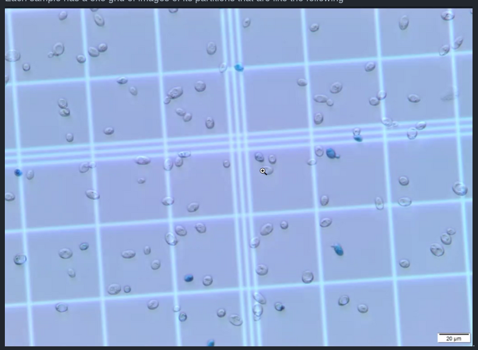

# Beer-Challenge-by-Visio

## Abstract
Measuring the quality of beer is an important task in industrial scale
fermentation processes. To do that, a lot of times, the proportion of
alive and dead yeast cells is used as the parameter that indicates this
quality measurement quantitatively. The procedure utilized for analyzing
this number involves diluting a fermentation sample with bromothymol blue
inside a Neubauer chamber and counting the numbers of alive and dead cells
through microscopic observation.

With that in mind, the objective of this challenge is to develop an image
processing method that calculates the amounts of both alive and dead cells
in a yeast sample. For that, one problem that needs to be tackled is that
since a single microscopic image can't cover the entirety of the observed
sample, images of its different parts must be used. Thus, to get a more
accurate estimate of the beer quality, the images of a partitioned sample
must be used to reconstruct an image that represents an entire sample.  The
other one is that the reconstructed image of a sample must be segmented in
such a way that the cells can be not only recognized, but also differentiated
as either dead or alive. 

## Example of input images
Each sample has a 5x5 grid of images of its partitions that are like the following
.
Tey are provided by the Visio Company

## Main image processing tasks involved
- Merge the grid of images into a single image through some Image Stitching method
- Recognize and count the number of cells with a blue color an with a gray color through Image segmentation
